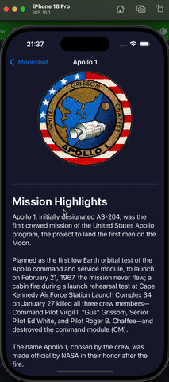

# 🧑🏻‍🚀 Moonshot - 100 Days of SwiftUI Solution  

Solution to the **[Moonshot from 100 Days of SwiftUI](https://www.hackingwithswift.com/books/ios-swiftui/finishing-up-with-one-last-view)**.

---

## 📑 Table of Contents  
- [About this project](#about-this-project)
- [Preview](#preview)
- [Technologies](#technologies)

---

### About This Project  
**Moonshot** is a native iPhone app that lets users learn about the missions and astronauts that formed NASA’s Apollo space program.

## 📌 Features & Concepts Used:  
- Codable data 
- Resizable Image 
- ScrollView and Lazy stacks 
- Grid layout

---

### Preview  

 

---

### Technologies  
**Languages & Tools:**  
- Swift  
- SwiftUI  
- Git
